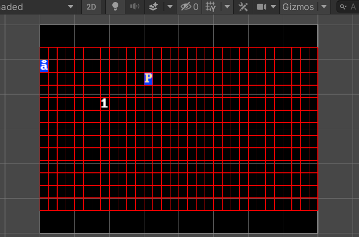

This package is for drawing old school ASCII terminals in the unity (porting of [Malison](https://github.com/munificent/malison)). 



## HOW TO USE:  
1.create empty scene  
2.add package prefab "RetroTerminal" into scene  
3.add your startup code  
```
int sw = UnityEngine.Screen.width;
int sh = UnityEngine.Screen.height;
retroTerminal = RetroTerminal.ShortDos(width, height, sw, sh, retroCanvas);
Camera.main.orthographicSize = sh / retroCanvas.pixelToUnits / 2;

retroTerminal.Push(new MainScreen());
retroTerminal.running = true;
```
Check "Samples~/Assets/Test" scene for more information.

## HOW TO DEV:
1.fork  
2.open Samples~ project & add your code  
3.click menu "Tool/Copy Package" to update package  
4.add this package into your project manifest.json, like  
```
"com.dongl1n.unity-terminal": "file:../../../unity-terminal"
```

## TODO(or not todo):  
[x]glyph fore color  
[x]led effect  
[x]terminal background color  
[x]glyph back color  
[+]terminal stetch fit  
[+]canvas fade in/out effect  
[+]text loop effect  
[+]text typewrite  


